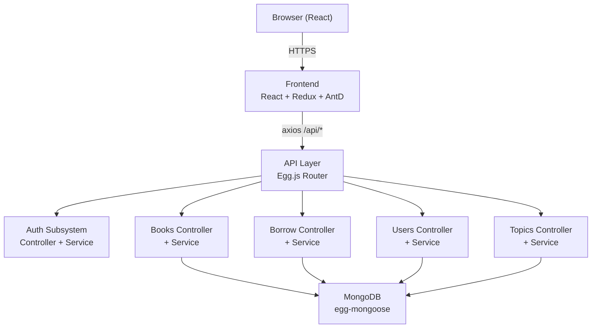

# Block Library — Architecture

> 社区共享图书管理系统，支持图书分享、借阅管理、积分激励、工具共享、议事广场五大功能模块。前台面向业主协作，后台面向运营管理。

---

## Subsystems

| Subsystem | Summary | Doc |
|---|---|---|
| Auth | JWT-like token authentication (base64-encoded userId:username) | [auth.md](./auth.md) |
| Books | 图书 CRUD、分类、ISBN 管理 | [books.md](./books.md) |
| Borrow | 借书/还书/预约全流程，含积分计算 | [borrow.md](./borrow.md) |
| Users | 用户管理、积分管理、角色权限 | [users.md](./users.md) |
| Topics | 议事广场：议题发布、评论、关注、热度计算 | [topics.md](./topics.md) |
| Points | 积分获取/兑换核心逻辑 | [points.md](./points.md) |
| Notifications | 到期提醒、预约到书通知 | [notifications.md](./notifications.md) |
| Frontend Pages | React 页面组件层（登录/仪表盘/图书/借阅/工具/设置等） | [frontend-pages.md](./frontend-pages.md) |
| Frontend Store | Redux slices + API interceptor 数据流 | [frontend-store.md](./frontend-store.md) |

---

## High-Level Diagram



---

## Tech Stack

| Layer | Technology | Notes |
|---|---|---|
| Frontend Runtime | React 18.2 | |
| Frontend State | Redux Toolkit | 6 slices: user/books/borrow/notification/tools/settings |
| Frontend UI | Ant Design 5 + AntD Mobile | 响应式组件库 |
| Frontend Router | React Router DOM 6 | |
| Frontend HTTP | axios | 请求/响应拦截器注入 token |
| Backend Runtime | Node.js | |
| Backend Framework | Egg.js 3.17 | |
| Backend Validation | egg-validate | |
| Database | MongoDB | egg-mongoose |
| Auth Token | base64(userId:username) | 简化 JWT，实际生产应换为真实 JWT |

---

## Cross-Cutting Concerns

### Authentication
所有受保护接口从 `Authorization: Bearer <token>` 提取 userId。Token 解码后挂载到 `ctx.state.user`。前端 axios 拦截器自动注入 token；401 响应时清空 localStorage 并跳转登录页。

### Error Handling
Controller 层使用 `ctx.success(data, msg)` 和 `ctx.fail(msg)`。Service 层抛出字符串错误消息，Controller 捕获后透传给 `ctx.fail(e.message)`。

### Data Flow (Backend)
```
Controller (thin) → Service (business logic) → Model (mongoose)
Controller 不含业务逻辑，只负责参数解析和响应组装
```

### Data Flow (Frontend)
```
API Layer (api/*.js) → Redux Thunk / createAsyncThunk → Reducer (store/*.js) → React Component
```

---

## Project Structure

```
block-library/
├── docs/                    # 文档（本文档）
├── frontend/
│   └── src/
│       ├── api/             # axios 实例 + 分模块 API
│       ├── components/      # 公共组件（AppLayout 等）
│       ├── pages/           # 页面组件（14 个）
│       ├── store/           # Redux store + settings + permissions
│       └── App.js           # 路由入口
├── backend/
│   ├── app/
│   │   ├── controller/      # 7 个 Controller
│   │   ├── service/         # 5 个 Service（base + user/book/borrow/topic）
│   │   ├── model/           # Mongoose 数据模型
│   │   ├── core/            # 核心类（BaseController, Exceptions）
│   │   └── router.js        # 路由汇总
│   ├── config/              # plugin.js / config.default.js
│   └── index.js             # 启动入口
└── mock-server.js           # 前端独立开发用的 Mock Server
```

---

## Findings

- **[ISSUE]** Auth 使用 base64 编码而非正式 JWT，无签名验证，token 可被伪造。建议生产环境接入 `egg-jwt` 或 `jsonwebtoken`。
- **[ISSUE]** Backend 仅有 `base_controller.js` 和 `user.js` 完成 Service 层重构，其他 Controller（borrow/book/topic）仍直接操作 Model，违反 Service 分层规范。
- **[REVIEW]** 前端 `settings.js` 中的 `ROLE_CONFIG` / `FEATURE_CONFIG` 从 `localStorage` 初始化，与 Redux store 的 `settings` slice 存在双数据源风险。